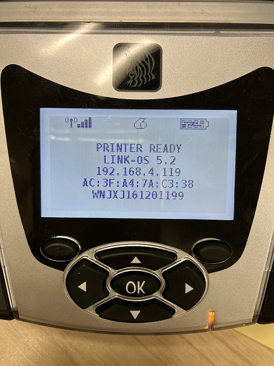

Mono Panel + 十字キーモデルのWMLサンプル

### セットアップ手順

1. プリンタとFTP接続し、バイナリに設定する。
    <pre>
    C:\Users\mogetan>ftp 192.168.4.50
    192.168.4.50 に接続しました。
    220 ZBR-79071 Version V85.20.25 ready.
    502 Unknown command 'UTF8'.
    ユーザー (192.168.4.50:(none)): zebra
    230 User logged in.
    ftp> bi
    200 Type set to I.
    </pre>
1. プリンタにINDEX.WMLを送信する。
1. プリンタを再起動する。
1. 液晶表示が変更されていることを確認する。
   
    

 
 

---

## WMLファイルを改変するときの注意点

 

1. オリジナルをfiletypeなどでダウンロードした場合、一部文字化けが発生することがある。"WML ERROR"の原因となるので、修正しておくこと。
    <pre>
    p1 fgcolor="0xFFFFFFFF" highlight="off" href="#main">瑳/p1>
    </pre>

1. WMLファイルはUTF-8で保存すること。

 
 

## V68.19.7Z以降をご利用の場合

 

下記リンクの手順も合わせて実施ください。

https://supportcommunity.zebra.com/s/article/QLn-index-wml-not-functioning-using-V68-19-7z-or-later-firmware?language=ja

